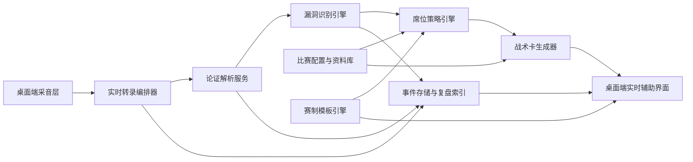

# 实时辩论辅助程序设计文档

Feature Name: debate-assistant
Updated: 2026-04-01

## Description

本系统定位为“赛时副驾”，不是赛后复盘工具。核心价值链路是：音频输入、实时转录、论证解析、逻辑漏洞识别、席位化策略生成、时间轴驱动提醒、跨端展示与会后复盘沉淀。设计优先级依次为：低时延、可执行建议、角色适配、稳定降级、跨端发布。

基于公开可得的华语竞技辩论常见流程，我将“新国辩类”规则抽象为以下能力边界：赛前可配置辩题与立场；赛中按立论、攻防申论或质询、自由辩、总结陈词分阶段切换辅助；赛后支持基于完整转录做复盘。由于公开检索难以稳定获得统一权威规则全文，本设计采用“可配置模板引擎”而非硬编码单一赛制，从而兼容不同年份与不同赛事细则。

席位策略默认如下：一辩维护定义、框架与主轴；二辩负责拆论、回应与局部战场建立；三辩负责高频交锋、追问链与节奏控制；四辩负责评判标准回收、有效交锋归纳与结辩收束。系统所有建议都围绕当前席位与当前回合重写表达形态。

## Architecture

建议采用“本地桌面壳 + 共享核心服务 + 可切换推理后端”的架构。桌面壳优先考虑 `Tauri + React`。理由是安装包较小、系统权限控制明确、前端工程生态成熟，且适合同时打包 macOS 与 Windows。共享核心服务可以用 TypeScript 编写，兼顾桌面前端、Node 辅助进程与后续 Web 观察端复用。实时任务通过本地 sidecar 或内嵌后台线程编排，避免浏览器主线程被音频处理阻塞。

转录与推理链路拆成多个短流水阶段。第一阶段负责音频切片、VAD、增量 ASR；第二阶段将稳定文本转成主张、论据、判准、定义等结构化对象；第三阶段同时运行规则漏洞检测与 LLM 深度分析；第四阶段由席位策略引擎读取当前回合、剩余时间、己方立场、预置知识库后生成战术卡。这样可以在 LLM 稍慢时先给出规则级短提示，再异步补充更深的建议。

## Components and Interfaces

1. `audio-capture`：负责麦克风、系统音频或混音输入，输出统一 PCM 流与设备状态。接口示例：`startCapture(sessionId, source)`、`switchInputDevice(deviceId)`。
2. `asr-orchestrator`：负责切片、缓存、实时 ASR 请求与置信度合并。输出 `TranscriptChunk`，包含文本、时间戳、稳定度、说话标签。
3. `argument-parser`：将转录片段转成结构化论证节点，接口示例：`parseChunk(chunk, context)`，输出 `ArgumentFrame[]`。
4. `fallacy-engine`：混合规则与模型识别逻辑漏洞，输出 `FallacyCandidate[]`，每项包含漏洞类型、证据片段、置信度、可攻击方向。
5. `seat-strategy-engine`：根据席位与回合选择提示模板、压缩风格与排序函数，输出 `StrategyIntent[]`。
6. `tactic-card-generator`：将策略意图转写成界面可见卡片，例如一句话反击、追问链、风险提示、备用话术。
7. `timeline-engine`：维护赛制模板、回合时钟、切换条件与超时事件，驱动 UI 与策略切换。
8. `knowledge-base`：保存赛前资料、案例、论点树与会后沉淀，支持关键词检索与引用。
9. `sync-and-git`：在开发与文档阶段接入 GitHub 自动提交；在产品运行阶段可选同步比赛配置与复盘数据。

核心接口应事件化，推荐采用 `event-bus` 或 `RxJS` 风格流式协议，例如 `TRANSCRIPT_UPDATED`、`ROUND_CHANGED`、`TACTIC_CARD_READY`。这样既利于并发编排，也方便后续增加教练端、观战端与录播回放端。

## Data Models

### DebateSession

- `id`: 比赛唯一标识。
- `topic`: 辩题。
- `stance`: 己方立场。
- `seat`: 当前用户席位。
- `ruleTemplateId`: 赛制模板标识。
- `roundState`: 当前回合与剩余时间。
- `strategyProfile`: 输出风格、激进程度、极简模式等。

### TranscriptChunk

- `id`: 片段标识。
- `sessionId`: 所属比赛。
- `startMs` / `endMs`: 时间戳。
- `text`: 增量或稳定文本。
- `stability`: 稳定度。
- `confidence`: 识别置信度。
- `speakerHint`: 己方或对方标签。

### ArgumentFrame

- `claim`: 主张。
- `support`: 论据。
- `warrant`: 推理桥梁。
- `criterion`: 比较标准。
- `definition`: 关键定义。
- `stanceAlignment`: 与己方立场的冲突关系。

### TacticCard

- `type`: 攻击、追问、澄清、回收、总结。
- `priority`: 优先级。
- `targetSnippetIds`: 关联原话。
- `oneLiner`: 一句话反击。
- `followUpQuestions`: 可连续追问。
- `riskNote`: 风险提示。
- `seatFit`: 适配席位。
- `roundFit`: 适配回合。

## Correctness Properties

1. 每条战术卡都必须可回溯到至少一个对方转录片段或至少一个己方预置知识节点。
2. 系统不能把低置信度猜测伪装成确定结论；所有不稳定分析必须显示置信标签。
3. 席位策略引擎不能输出与当前回合明显不相容的建议，例如在自由辩末段仍持续生成长篇立论。
4. 赛制模板必须在开始前完成校验，避免出现缺少回合时长或席位映射导致的时间轴错乱。
5. 降级模式必须保证基础可用，即使 LLM 完全失效，也应保留转录、时间线与规则级提醒。

## Rule Template Strategy

系统不把“新国辩”视为固定脚本，而是视为一组高频模式：开篇立论、阶段性交锋、自由辩拉扯、结辩收束。模板字段建议包括：

- `rounds[]`: 回合顺序、名称、时长、允许席位。
- `assistStyle`: 每回合建议长度、刷新频率、主打动作。
- `seatGoals`: 一辩到四辩的默认目标与排序权重。
- `timePrompts`: 每个回合剩余 60 秒、30 秒、10 秒时的提示策略。
- `winConditions`: 评判偏好的默认假设，例如更重交锋、重定义、重比较或重叙事。

对于新国辩类模板，我建议默认实现为：

- 一辩阶段：突出定义、判准、主轴一致性与被攻击点预警。
- 二辩阶段：突出拆论、补证、对位回应、建立局部主场。
- 三辩阶段：突出追问链、短句压迫、对方失答标记、节奏建议。
- 四辩阶段：突出未回应点归纳、评判标准回收、结辩三段式结构。

## Error Handling

- 音频设备不可用：UI 明确展示权限失败、设备占用或采样错误，并引导切换输入源。
- ASR 超时或失败：回退到备用服务或本地轻量模型，并降低刷新频率。
- LLM 超时：先展示规则引擎提示，例如“缺少比较对象”“定义未落地”“因果链断裂”，随后在后台继续尝试深度分析。
- 网络离线：本地继续缓存转录与时间轴，待网络恢复后补传。
- 模板配置错误：阻止开赛，并指出缺少字段而不是在赛中报错。
- GitHub 自动提交失败：保留本地提交状态并提示认证、权限或远程冲突问题。

## Packaging and Delivery

首发建议聚焦桌面客户端：

1. 使用 `Tauri` 构建 macOS 与 Windows 安装包。
2. 使用 GitHub Actions 构建多平台产物与发布草稿。
3. 使用统一配置文件描述模型供应商、ASR 供应商、赛制模板与席位策略。
4. 后续如需教练协同，可新增 Web 观察端，仅消费同一事件流和存储层。

开发阶段的“每做完一个提交就自动提交到 GitHub”建议实现为：本地提交规范与 CI 双层机制。开发者在完成一个任务单元后触发标准脚本，脚本执行测试、`git add`、`git commit`、`git push`；GitHub Actions 负责构建、校验与发布。这样可满足自动化要求，同时避免在未验证代码时频繁推送脏提交。

## Test Strategy

测试要围绕“实时性 + 正确性 + 角色适配”展开：

1. 单元测试：覆盖赛制模板解析、时间轴切换、漏洞分类规则、战术卡排序与席位化重写。
2. 合约测试：覆盖 ASR 供应商与 LLM 供应商适配层，验证请求超时、错误码与降级逻辑。
3. 回放测试：使用历史辩论录音片段离线回放，验证转录到战术卡的端到端时延与稳定性。
4. 场景测试：分别模拟一辩、二辩、三辩、四辩在不同回合下收到的建议是否符合职责。
5. 打包测试：在 macOS 与 Windows 上验证麦克风权限、安装流程、自动更新与构建产物完整性。
6. CI 流程：每次提交后运行静态检查、单元测试、关键回放测试与桌面构建。

## References

[^1]: (README.md:1) - 项目当前仅含基础占位说明，适合先补齐规格设计。 
[^2]: (https://www.bing.com/search?q=%22%E6%96%B0%E5%9B%BD%E8%BE%A9%22+site%3Aedu.cn) - 公开检索结果显示可获取的规则信息较分散，因此设计采用模板化抽象而非单一固定赛制。
